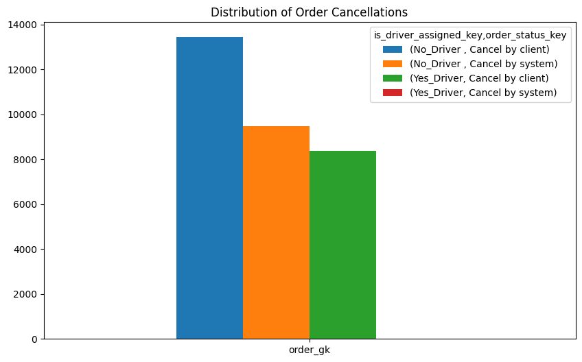
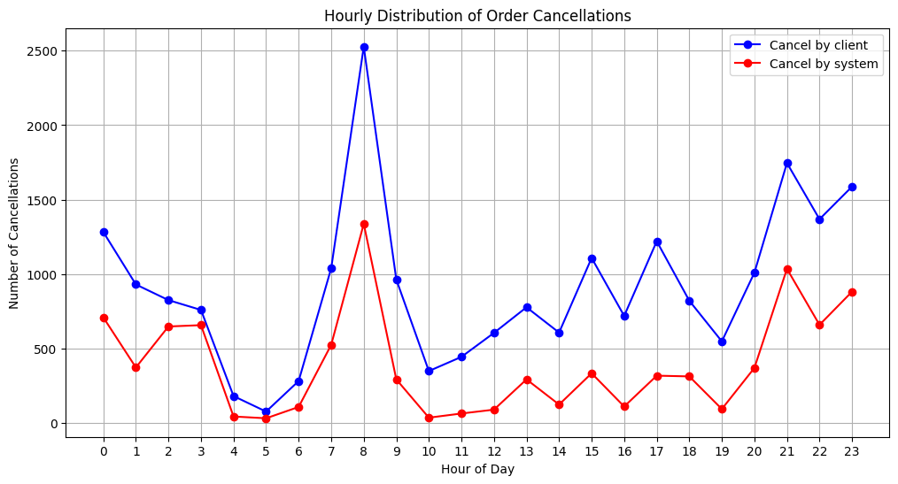
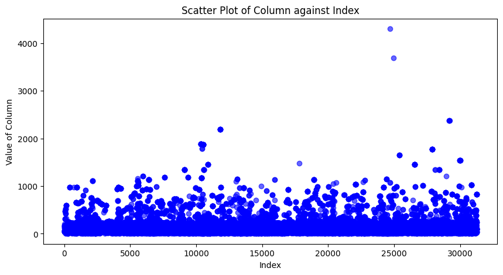
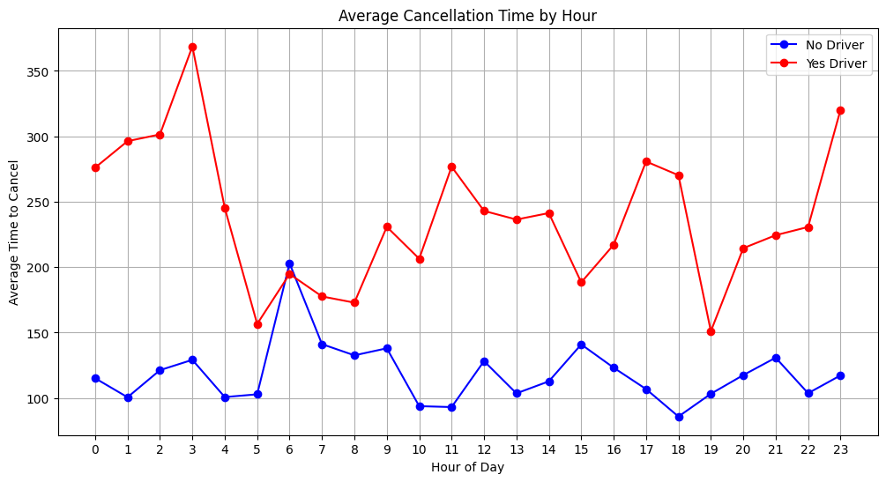
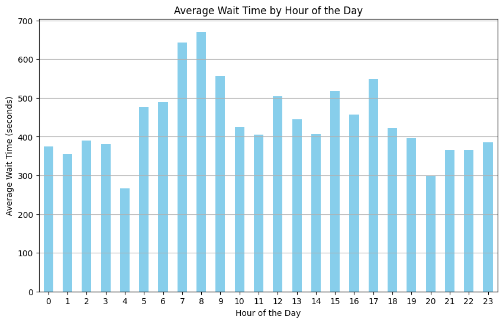
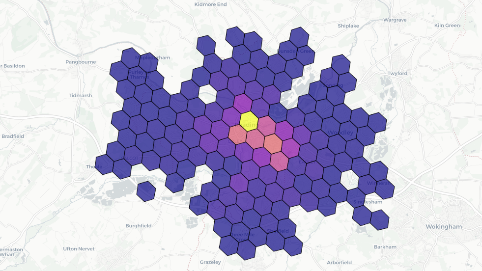

## Dataset

The datasets (`data_orders.csv`, `data_offers.csv`) are collected from [stratascratch](https://platform.stratascratch.com/)

## Analysis

The script performs the following tasks:

1. **Load the Dataset**: Reads the data and explore
2. **Filter Data**: Filters rows considering different scenarios
3. **Calculate Statistics**: Computes descriptive statistics tto measure the output
4. **Plot Distribution**: Plots the distribution 

## Results

The output includes:

- Distribution of Order Cancellations and analysis

    1. Cancel by client before assigning driver is the highest category. I think this high number is due to high amount of time for getting driver. After waiting for a while, when the customers are not getting driver, they have cancelled the trip.
    2. Same is true for the second highest category when driver is not assigned and system cancelled the trip. As the system has not found any matching driver for a while, it has cancelled the trip
    3. The third one is client cancelled the trip after driver assignment. This is probably the wait time for customer was long and customers have arranged another way as long as the driver assigned. 
    4. On the other hand, cancel by system after assigning driver is the lowest category(only 4). It probably happened due to system error.

- Hourly Distribution of Order Cancellations and analysis

    For both client and system order cancel have an abnormally high proportion at 8 a.m. I think this is a rush hour as it is a office time. So if the taxi delays for few time, customers are tend to cancel the trip. Also as this is busy hour, getting free taxi at nearby position in this time also difficult.
- Average Cancellation Time by Hour

    The average time of cancellation at 3 a.m. is higher with driver. This indiactes that at midnight there may be a scarcity of driver that takes a long time to assign driver and results high average of cancellation. On the other hand, average time of cancel without driver is higher at 6 a.m.
- Average Wait Time by Hour of the Day

    From this plot, we can see that average time is high at 8 am. It is reasonable because previously in the plot of Question 2, we have seen that this time has highest cancel by client value without driver assignment.
- hexagons on the map and colored by the number of fails.

    1. Each hexagon on the map presents an area covered by a hex ID
    2. Yellow hexagon represents highest count of 'order_gk'
    3. Dark purple represents lower count of 'order_gk'